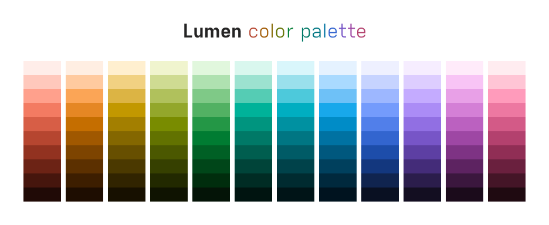
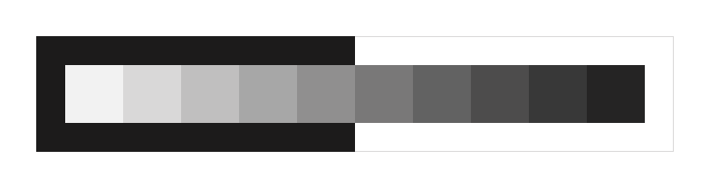
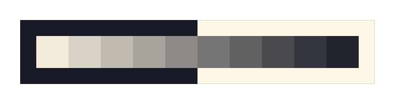
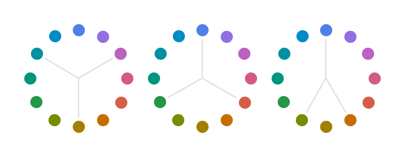
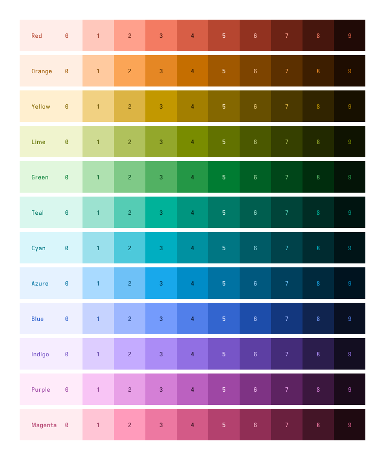
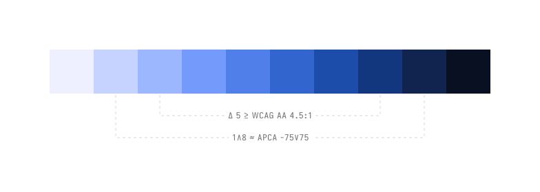

<h1 align="center">
	
</h1>

**Lumen** is a modern color scheme designed for perceptual uniformity, vibrancy, and accessibility on digital screens. It features carefully crafted base and accent palettes that ensure consistent contrast, tonal symmetry, and harmonious color relationships. Lumen supports both light and dark themes, making it suitable for a wide range of applications where readability and visual comfort are priorities.

## Base Colors

Base palettes are composed by low-chroma colors, intended for use as background and text colors. Lumen's default base palette comes in two versions, **Maxima** and **Minima**. Based on these palettes, Lumen defines two dark themes, called **Nox Maxima** and **Nox Minima**, and two light themes, called **Lux Maxima** and **Lux Minima**.

### Maxima

Lumen Maxima is a monochromatic palette that transitions from pure white to dark gray. This is a simple and neutral option for those who want, or need, an unopinionated base color palette.

	

### Minima

Lumen Minima is a polychromatic palette that blends a soft yellow with dark blue. Inspired by the interaction of sunlight and shadow on white paper, Minima is designed to ease eye strain during extended reading or writing sessions on digital screens by offering *slightly* reduced contrast and lower light emissions.

	

## Accent Colors

Lumen's accent colors span the entire color wheel with evenly spaced hues. This design enables the use of color theory relationships—such as complementary, triadic, and analogous schemes—to select distinct yet harmonious color combinations.

	

Each accent color is divided into 10 perceptually uniform tones using Google’s HCT color space. HCT combines CAM16's hue and chroma with CIELAB lightness, ensuring that no single color appears disproportionately brighter or darker than the others.

	

## Features

### Symmetry

Lumen's palettes are designed with tonal symmetry: the 10 tones are balanced so that the 5 lighter tones provide similar contrast on dark backgrounds as the 5 darker tones do on light backgrounds. This ensures consistent readability and visual harmony across both light and dark themes.

	

### Contrast

Calculating contrast ratios for every color combination can be tedious. Lumen simplifies this by organizing color steps with contrast in mind. To meet WCAG AA standards (minimum 4.5:1 contrast), simply choose colors that are at least 5 steps apart (Δ 5). For even greater accessibility, using steps 1 and 8 guarantees sufficient contrast according to [APCA](https://git.apcacontrast.com/) [Bronze Simple Mode](https://readtech.org/ARC/tests/bronze-simple-mode/?tn=criterion) criterion (≈ -75∨75).

	

## Inspiration

- [Solarized](https://ethanschoonover.com/solarized) by Ethan Schoonover.
- [Flexoki](https://stephango.com/flexoki) by Steph Ango.
- [Material Design 3](https://m3.material.io) by Google.

## License

[MIT](https://github.com/albertobeloni/lumen/blob/main/LICENSE) © [Alberto Beloni](https://github.com/albertobeloni)
